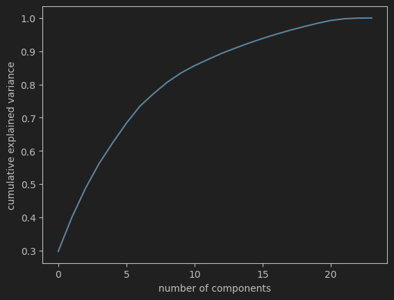
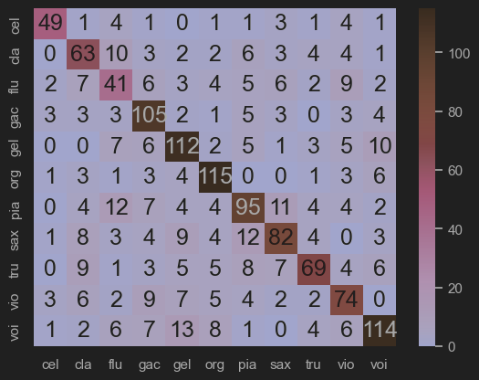

# Sonic Subterfuge

Ryan Eaton (rle22@njit.edu)

Course project for New Jersey Institute of Technology - CS485 : Special Topics in Machine Listening, Professor Mark Cartwright.

# Introduction

In this project, the attempt is to find the minimal changes made to a predominant-instrument source audio signal needed to trick a classifier into classifying it as another instrument as desired. The experiment did not succeed up to desired levels, but a lot was learned.

## Motivation

The motivation behind this project is to see if there is an audio analog to what we have been seeing with some visual machine learning systems recently. The image classifiers produce confidence values for each class and it is assumed that the class with the highest confidence is the system’s answer. However, studies have been finding that these confidence values are very volatile and sometimes are affected significantly by minuscule changes in a source image. Sometimes, small perturbations added to the source image - such that the image remains indistinguishable to the naked eye - can lead the system to classify the image incorrectly, and give a false-positive with high confidence for a completely unrelated class.

As stated, the motivation behind this project is to experiment with how this principle can be applied to audio signals and to find whether it is possible to select a specific desired classification, while remaining perceptually unchanged to humans. If time permits, related experimentation could be done to generate a signal that maximizes classification confidence for a particular label. The result would probably be unintelligible, but it would be interesting to hear what that might sound like.

# Prerequisites

Before we can fool a model, there are some things we need to do first!

## The Dataset

Our code will attempt to create adversarial examples using inputs from “IRMAS: a dataset for instrument recognition in musical audio signals.” The IRMAS dataset comes pre-labeled. Each audio recording in the dataset is associated with one of 11 instrument classes: cello, clarinet, flute, acoustic guitar, electric guitar, organ, piano, saxophone, trumpet, violin, and human singing voice. It consists of 6705 training examples and 2874 testing examples, making a total of 9582 audio recordings. The audio files in the IRMAS dataset are provided in 16 bit stereo .wav format sampled at 44.1kHz.

## The Model to Fool

Ideally the classifier which mine will be the adversary of will have also been trained using methods suitable for IRMAS, such as the following project from 2019 which achieved a 79% accuracy. It was also trained on IRMAS and performed better than the state-of-the-art predominant instrument classifiers at the time. Their best performing model used [C-Support Vector Classification](https://towardsdatascience.com/diving-into-c-support-vector-classification-221ced32e4b4).

[Their Github](https://github.com/vntkumar8/musical-instrument-classification)

Their model uses a set of features based on `rms`, `spectral_centroid`, `spectral_bandwidth`, `rolloff`, `zero_crossing_rate`, and averaged `mfcc` coefficients.
Their study shows that these 20-or-so features explain most of the variance in the instrument classifications.



## Model Modifications

Out of curiosity, I decided to make some modifications to the original model's training to see if I could improve it.

### Hyperparameter Tuning

I used a Randomized Search to find the best parameters for the SVC model.

```python
# Define the parameter distributions
param_dist = {'C': uniform(0.1, 20),          # Uniform distribution between 0.1 and 20
              'kernel': ['rbf'],
              'degree': randint(2, 5),          # Discrete uniform distribution between 2 and 4
              'gamma': [0.1, 1, 10, 100]}

# Create the SVC model
svc = SVC()

# Create the RandomizedSearchCV object
random_search = RandomizedSearchCV(svc, param_distributions=param_dist, n_iter=100, cv=5, random_state=42)

# Fit the model to the data
random_search.fit(X_train, y_train)
```

Which found the best parameters of `{'C': 10.781788387508838, 'degree': 3, 'gamma': 0.1, 'kernel': 'rbf'}`.
This ended up increasing the acfuracy from ~79% to ~80.5%.

### More Classes

I also noticed that the model had limited the classes from the IRMAS set. My guess for this was to select the classes that were most different from each other so that the model would have a better perceived performance.
I changed it to include all of the classes and ended with a ~68.5% accuracy on the test set.

Below is a confusion matrix for my modified and tuned version of their SVC model. 



# Things tried

# Results of Genetic Algorithm

## Why it failed - other things to try

# Joining the Good Side

Lessons learned