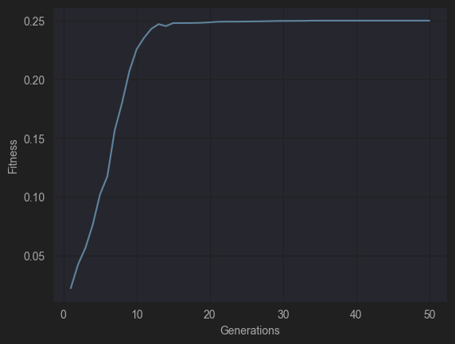
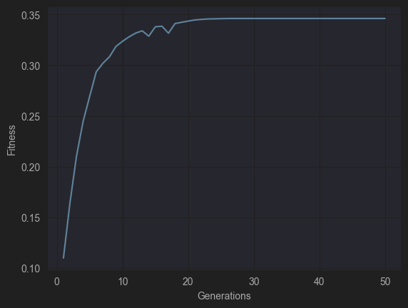
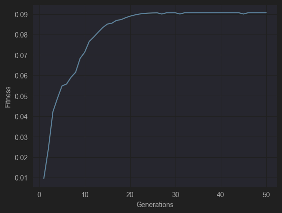
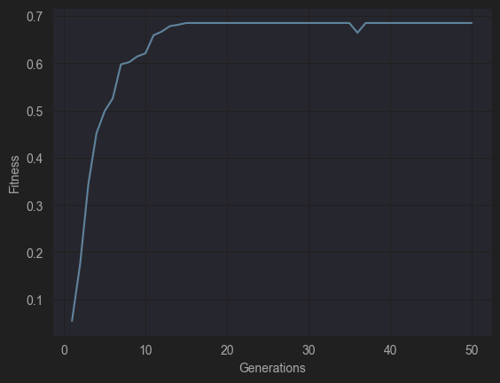

# Sonic Subterfuge

Ryan Eaton (rle22@njit.edu)

Course project for New Jersey Institute of Technology - CS485 : Special Topics in Machine Listening, Professor Mark Cartwright.

# Introduction

In this project, the attempt is to find the minimal changes made to a predominant-instrument source audio signal needed to trick a classifier into classifying it as another instrument as desired. The experiment did not succeed up to desired levels, but a lot was learned.

## Motivation

The motivation behind this project is to see if there is an audio analog to what we have been seeing with some visual machine learning systems recently. The image classifiers produce confidence values for each class and it is assumed that the class with the highest confidence is the system’s answer. However, studies have been finding that these confidence values are very volatile and sometimes are affected significantly by minuscule changes in a source image. Sometimes, small perturbations added to the source image - such that the image remains indistinguishable to the naked eye - can lead the system to classify the image incorrectly, and give a false-positive with high confidence for a completely unrelated class.

As stated, the motivation behind this project is to experiment with how this principle can be applied to audio signals and to find whether it is possible to select a specific desired classification, while remaining perceptually unchanged to humans. If time permits, related experimentation could be done to generate a signal that maximizes classification confidence for a particular label. The result would probably be unintelligible, but it would be interesting to hear what that might sound like.

# Prerequisites

Before we can fool a model, there are some things we need to do first!

## The Dataset

Our code will attempt to create adversarial examples using inputs from “IRMAS: a dataset for instrument recognition in musical audio signals.” The IRMAS dataset comes pre-labeled. Each audio recording in the dataset is associated with one of 11 instrument classes: cello, clarinet, flute, acoustic guitar, electric guitar, organ, piano, saxophone, trumpet, violin, and human singing voice. It consists of 6705 training examples and 2874 testing examples, making a total of 9582 audio recordings. The audio files in the IRMAS dataset are provided in 16 bit stereo .wav format sampled at 44.1kHz.

## The Model to Fool

Ideally the classifier which mine will be the adversary of will have also been trained using methods suitable for IRMAS, such as the following project from 2019 which achieved a 79% accuracy. It was also trained on IRMAS and performed better than the state-of-the-art predominant instrument classifiers at the time. Their best performing model used [C-Support Vector Classification](https://towardsdatascience.com/diving-into-c-support-vector-classification-221ced32e4b4).

[Their Github](https://github.com/vntkumar8/musical-instrument-classification)

Their model uses a set of features based on `rms`, `spectral_centroid`, `spectral_bandwidth`, `rolloff`, `zero_crossing_rate`, and averaged `mfcc` coefficients.
Their study shows that these 20-or-so features explain most of the variance in the instrument classifications.


## Model Modifications

Out of curiosity, I decided to make some modifications to the original model's training to see if I could improve it.

### Hyperparameter Tuning

I used a Randomized Search to find the best parameters for the SVC model.

```python
# Define the parameter distributions
param_dist = {'C': uniform(0.1, 20),          # Uniform distribution between 0.1 and 20
              'kernel': ['rbf'],
              'degree': randint(2, 5),          # Discrete uniform distribution between 2 and 4
              'gamma': [0.1, 1, 10, 100]}

# Create the SVC model
svc = SVC()

# Create the RandomizedSearchCV object
random_search = RandomizedSearchCV(svc, param_distributions=param_dist, n_iter=100, cv=5, random_state=42)

# Fit the model to the data
random_search.fit(X_train, y_train)
```

Which found the best parameters of `{'C': 10.781788387508838, 'degree': 3, 'gamma': 0.1, 'kernel': 'rbf'}`.
This ended up increasing the accuracy from ~79% to ~80.5%.

### More Classes

I also noticed that the model had limited the classes from the IRMAS set. My guess for this was to select the classes that were most different from each other so that the model would have a better perceived performance.
I changed it to include all of the classes and ended with a ~68.5% accuracy on the test set.

Below is a confusion matrix for my modified and tuned version of their SVC model. 


A summary of my updated code is also available [in the code](/code/model/Their-Model-Updated.ipynb), and a trained model itself can be found [here](/code/model/their_tuned_model.pkl). 

# Generating Adversarial Examples

In lieu of learning a kernel for modifying an entire audio file, I needed some concise
way of representing the changes needing to be made to an audio file to make it appear
like another instrument. I was thinking of using the MFCC since it is commonly used as a
concise representation of timbre (and is prominently used in our model that we are trying to fool). But there are two problems:
- It’s not possible to perfectly reconstruct a source audio signal from an MFCC.
- The model I trained only uses the average of each time bin for
  the MFCC to determine timbre, so any number of changes to the original MFCC
  will be collapsed into a single number.

MFCC might not be the way to go...

Instead, I could perform gradient descent on the STFT of the audio with regard to the gradient of the input vs. the loss (being some function of the confidence of being the desired class, returned from the model).
Using the STFT is good because it is [invertible with minimum quality loss](https://en.wikipedia.org/wiki/Short-time_Fourier_transform). However, the model chosen for this project did not seem to be automatically differentiable by tensorflow, and I was therefore not able to compute the gradients. It may be possible though, more on this later.

So, the next logical step for a black-box-like model where we don't have gradients, is to use a Genetic Algorithm.

Genetic Algorithms are beneficial in this case because without having access at all to an existing model, we can create examples that perform to our desire on that model.
A population of individuals are randomly mutated and combined according to the scoring function (the model we want to fool) and, over time, the theory is that as individuals die off (not good enough for the scoring function), they will be replaced by a dominant population of mutants that accidentally increased the score.

In short, Genetic Algorithms are optimization algorithms inspired by the process of natural selection. They consist of a population of potential solutions, which undergo selection, crossover, and mutation to evolve towards an optimal solution.

## Genetic Algorithm for Audio

The following outline is a general idea of how a genetic algorithm would work in the audio space. This was implemented in [the code](/code/GeneticAlgo.ipynb).

1. Representation of Audio
   - Represent the audio signal as a sequence of values, such as the amplitude over time.
   - Each individual in the genetic algorithm population represents a potential adversarial example.

2. Objective Function (Fitness Function)
   - Define a fitness function that quantifies the success of the adversarial attack.
   - It should capture the degree to which the modified audio leads to misclassification.
   - Ideally some consideration should be made here to also minimize the perceived difference from the original audio.

3. Initialization
   - Generate a population of candidate adversarial examples, starting with the original audio.
   - Apply small perturbations to the audio to create diverse individuals.

4. Evaluation
   - Evaluate the fitness of each individual by feeding it into the target model.
   - The fitness is determined by how successful the adversarial example is in misguiding the model while maintaining audio quality.

5. Selection
   - Select individuals from the population based on their fitness scores.
   - Individuals with higher fitness (more successful adversarial examples) have a higher chance of being selected.

6. Crossover
   - Combine pairs of selected individuals to create new candidates.
   - This mimics the crossover of genetic material in natural reproduction.

7. Mutation
   - Introduce random changes to some individuals in the population to maintain diversity.
   - Simulate genetic mutation to explore a broader solution space.

8. Replacement
   - Replace the old population with the new one, which includes the original individuals, selected individuals, and newly generated individuals.

Repeat the evaluation, selection, crossover, mutation, and replacement steps for a defined number of generations or until an individual sufficiently maximizes the fitness function (our adversarial example).

Pursuant to this, the [DEAP Python framework](https://github.com/deap/deap) was used to run the genetic experiment.

> DEAP is a novel evolutionary computation framework for rapid prototyping and testing of ideas. It seeks to make algorithms explicit and data structures transparent. It works in perfect harmony with parallelisation mechanism such as multiprocessing and SCOOP.

Individuals were initialized with the STFT of the given audio signal.
Mutation was defined as adding to an individual some Gaussian noise scaled to some constant.
Crossover was defined as averaging two individuals together.
And finally, the evaluation function used was the trained model's predicted probability of an individual being classified as our desired output class. 

# Results of Genetic Algorithm

On to the results of this experiment!

## Examples

These inputs and desired classes were chosen semi-randomly.

| # | Original Class | Original Audio                                                                | Desired Class | Perturbed Audio                                                 | Probability After Perturbed |
|-----------|----------------|-------------------------------------------------------------------------------|---------------|-----------------------------------------------------------------|-----------------------------|
| 1         | flu 83%        | [008\_\_[flu][nod][cla]0393\_\_1.wav](assets\008__[flu][nod][cla]0393__1.wav) | tru 1%        | [flu-to-tru.wav](assets\008__[flu][nod][cla]0393__1-to-tru.wav) | tru 14%                     |
| 2         | tru 92%        | [[tru][cla]1954\_\_3.wav](assets\[tru][cla]1954__3.wav)                       | flu 1%        | [tru-to-flu.wav](assets\[tru][cla]1954__3-to-flu.wav)           | flu 25%                     |
| 3         | cel 97%        | [065\_\_[cel][nod][cla]0059\_\_2.wav](assets\065__[cel][nod][cla]0059__2.wav) | pia 0.3%      | [cel-to-pia.wav](assets\065__[cel][nod][cla]0059__2-to-pia.wav) | pia 35%                     |
| 4         | cel 97%        | ^^                                                                            | gel 0.03%     | [cel-to-gel.wav](assets\065__[cel][nod][cla]0059__2-to-gel.wav) | gel 9%                      |
| 5         | cel 97%        | ^^                                                                            | vio 1.3%      | [cel-to-vio.wav](assets\065__[cel][nod][cla]0059__2-to-vio.wav) | vio 68.5%                   |
| 6         | voi 28%        | [[voi][pop_roc]2353\_\_3.wav](assets\[voi][pop_roc]2353__3.wav)               | cel 0.2%      | [voi-to-cel.wav](assets\[voi][pop_roc]2353__3-to-cel.wav)       | cel 1.3%                    |
| 7         | voi 28%        | ^^ Trying to make it more like itself                                         | voi 28%       | [voi-to-voi.wav](assets\[voi][pop_roc]2353__3-to-voi.wav)       | voi 88.5%                   |

Example #2


Example #3


Example #4


Example #5


Example #7


## Summary

Over all, the experiment's results were very interesting. I was unable to meet my initial goal of making the audio changes imperceptible to humans.
There is admittedly a lot of noise added into the original audio, but the original audio is undoubtedly still recognizable to humans.

Additionally, it seemed that the genetic algorithm was only able to push the model into a direction that the model was already confused about. Similar classes made it easier to confuse the model. For example, `trumpet to flute` were easy to trick, but `cello to electric guitar`, or `voice to cello` were hard.

An interesting example I tried was picking a `voice` class audio signal and trying to make it *more*... `voice`.
The sample's predicted probability of being `voice` was quite low, 28%. Running the genetic algorithm on this audio with the goal of making it as `voice` as possible, a predicted probability of 88.5% for being `voice` was achieved with the perturbed audio. It was very easy for the genetic algorithm to find a local maximum for the audio sample which was already on its way to being the best `voice` it could be.

### Local Maxima

Local maxima are huge problems for genetic algorithms. In the presence of local maxima, the algorithm may experience stagnation, where the population converges to a homogeneous set of similar solutions. This lack of diversity hampers the ability of the genetic algorithm to explore alternative solutions and can lead to premature convergence.

Due to the size of the individual, and perhaps the naïveté of mutation, it seems the algorithm would often get stuck at suboptimal solutions, plateauing no matter how long I waited.

### Is the algorithm actually doing anything?

When I originally saw these results, I assumed that the genetic algorithm wasn't doing anything. I figured it was probably just adding noise randomly and shifting all probabilities closer and closer to a random weighted distribution of probabilities latent from training, or something like that.

But repeated tests indicated that the genetic algorithm would consistently at least nudge audio in the direction of choice, rather than in all directions. Sometimes a similar class would also be affected, but I am fairly confident that it is actually doing something.
Of course, it still seemed to settle on local maxima.

## Relevant Papers

While working on this project, I consulted research papers, several of which I would like to highlight below.

* [Practical Black-Box Attacks against Machine Learning](https://arxiv.org/pdf/1602.02697.pdf)

  This paper proposes a way to generate adversarial examples for a model without having access to the model or knowing anything about it. This was achieved in the paper by training a model of their own and finding that adversarial examples generated for it did well against the black-box model. This could be achieved as well in the audio space, and potentially allow FGSM to be executed on the input audio for better adversarial results.

* [Adversarial Attack Using Genetic Algorithm](https://medium.com/analytics-vidhya/adversarial-attack-using-genetic-algorithm-90beba13b6cb)
  

   This medium article by Pavel Tyshevskyi provides a nice introduction to how genetic algorithms can be used to produce adversarial examples for an existing classification model.

* [Audio Adversarial Examples: Targeted Attacks on Speech-to-Text](https://arxiv.org/abs/1801.01944)

   This paper represents my lofty goals when starting this paper. They found a way to differentiate through the entire audio classification system (in this case Mozilla's DeepSpeech) and run gradient descent on input audio to achieve adversarial results 100% of the time, indistinguishable to human listeners.
   What they did is incredible!

# Joining the Light Side

We're not done yet! Instead of attacking, let's help now!

Noise is often an issue for classification models which use carefully curated inputs. The samples in the IRMAS dataset are quite nice, recorded in 16-bit sterio wav format, sampled at 44.1kHz. The examples generated by the genetic algorithm sound like audio recorded on a bad microphone, like those typically present in laptops even today. If a bad recording is enough to decrease classification confidence, then the model was just asking to be fooled.

Let's try improving it by generating some noisy audio and supplementing it into the training set.

